# Flowchart Sistem SIA VD

Diagram Mermaid untuk alur di [system-flow.md](system-flow.md). Keduanya disusun dari kode di cabang `main` pada commit `693048f`. Penjelasan lengkap tiap validasi, status, dan butir **Perlu dikonfirmasi** ada di dokumen teks. Di diagram, butir yang perlu dikonfirmasi ditandai dengan catatan (PD-nomor), merujuk ke nomor di [bagian 18](system-flow.md#18-perlu-dikonfirmasi).

Versi HTML yang siap dibaca di browser (diagram dirender statis, bisa diperbesar dan diunduh): [system-flowchart.html](system-flowchart.html). Bangun ulang dengan `python3 docs/build-flowchart-html.py` setiap kali berkas ini berubah.

## Daftar diagram

1. [Peta aktor dan modul](#1-peta-aktor-dan-modul)
2. [Siklus satu semester](#2-siklus-satu-semester)
3. [Login dan pemeriksaan izin](#3-login-dan-pemeriksaan-izin)
4. [Lupa kata sandi](#4-lupa-kata-sandi)
5. [Tagihan semester dan kunci KRS](#5-tagihan-semester-dan-kunci-krs)
6. [Mengambil kelas di KRS](#6-mengambil-kelas-di-krs)
7. [Batal dan simpan KRS](#7-batal-dan-simpan-krs)
8. [Kelas, jadwal, dan pertemuan](#8-kelas-jadwal-dan-pertemuan)
9. [Status pertemuan](#9-status-pertemuan)
10. [Presensi mandiri QR/PIN](#10-presensi-mandiri-qrpin)
11. [Pengajuan izin/sakit](#11-pengajuan-izinsakit)
12. [Pengumpulan dan penilaian tugas](#12-pengumpulan-dan-penilaian-tugas)
13. [Mengerjakan quiz](#13-mengerjakan-quiz)
14. [Jadwal ujian UTS/UAS](#14-jadwal-ujian-utsuas)
15. [Mengerjakan dan menilai ujian](#15-mengerjakan-dan-menilai-ujian)
16. [Nilai akhir dan kunci nilai](#16-nilai-akhir-dan-kunci-nilai)
17. [Remidi dari awal sampai akhir](#17-remidi-dari-awal-sampai-akhir)
18. [Status tagihan remidi](#18-status-tagihan-remidi)
19. [Huruf akhir peserta remidi](#19-huruf-akhir-peserta-remidi)
20. [Ujian susulan dari awal sampai akhir](#20-ujian-susulan-dari-awal-sampai-akhir)
21. [Status pengajuan susulan](#21-status-pengajuan-susulan)
22. [Status tagihan susulan](#22-status-tagihan-susulan)
23. [Tugas akhir sampai wisuda](#23-tugas-akhir-sampai-wisuda)
24. [Status pengajuan TA, pendadaran, dan wisuda](#24-status-pengajuan-ta-pendadaran-dan-wisuda)
25. [Status pendadaran](#25-status-pendadaran)
26. [Pindah kelas](#26-pindah-kelas)
27. [Hubungan data utama](#27-hubungan-data-utama)

---

## 1. Peta aktor dan modul

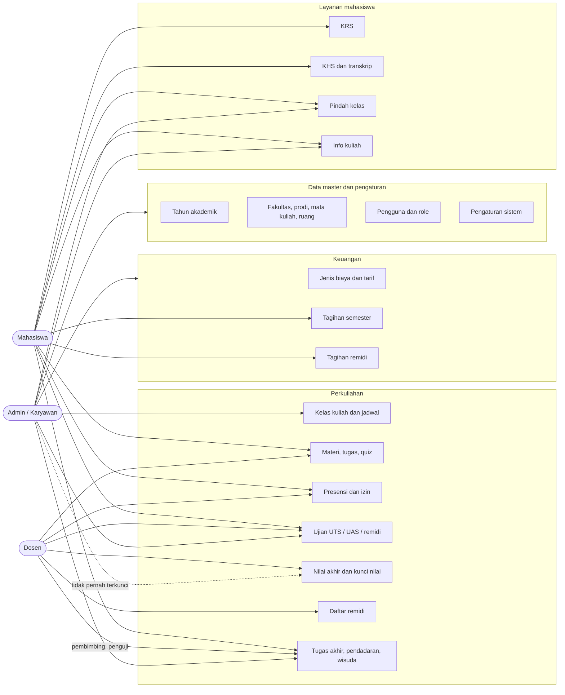
```mermaid
flowchart LR
    Admin(["Admin / Karyawan"])
    Dosen(["Dosen"])
    Mhs(["Mahasiswa"])

    subgraph Master["Data master dan pengaturan"]
        TA["Tahun akademik"]
        MD["Fakultas, prodi, mata kuliah, ruang"]
        User["Pengguna dan role"]
        Setel["Pengaturan sistem"]
    end

    subgraph Akademik["Perkuliahan"]
        Kelas["Kelas kuliah dan jadwal"]
        Konten["Materi, tugas, quiz"]
        Presensi["Presensi dan izin"]
        Ujian["Ujian UTS / UAS / remidi"]
        Nilai["Nilai akhir dan kunci nilai"]
        Remidi["Daftar remidi"]
        TaMod["Tugas akhir, pendadaran, wisuda"]
    end

    subgraph Keuangan["Keuangan"]
        Biaya["Jenis biaya dan tarif"]
        Tagihan["Tagihan semester"]
        TagRem["Tagihan remidi"]
    end

    subgraph Mahasiswa["Layanan mahasiswa"]
        KRS["KRS"]
        KHS["KHS dan transkrip"]
        Pindah["Pindah kelas"]
        Info["Info kuliah"]
    end

    Admin --> Master
    Admin --> Kelas
    Admin --> Keuangan
    Admin --> Ujian
    Admin --> Pindah
    Admin --> Info
    Admin --> TaMod
    Admin -. "tidak pernah terkunci" .-> Nilai

    Dosen --> Konten
    Dosen --> Presensi
    Dosen --> Ujian
    Dosen --> Nilai
    Dosen --> Remidi
    Dosen -- "pembimbing, penguji" --> TaMod

    Mhs --> KRS
    Mhs --> Konten
    Mhs --> Presensi
    Mhs --> Ujian
    Mhs --> KHS
    Mhs --> Pindah
    Mhs --> Tagihan
    Mhs --> TagRem
    Mhs --> Info
    Mhs --> TaMod
```

## 2. Siklus satu semester

Urutan besar proses dalam satu tahun akademik. Setiap kotak diperinci di diagram berikutnya.

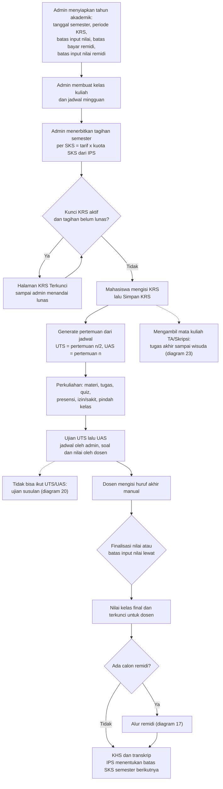
```mermaid
flowchart TD
    A["Admin menyiapkan tahun akademik:<br/>tanggal semester, periode KRS,<br/>batas input nilai, batas bayar remidi,<br/>batas input nilai remidi"] --> B["Admin membuat kelas kuliah<br/>dan jadwal mingguan"]
    B --> C["Admin menerbitkan tagihan semester<br/>per SKS = tarif x kuota SKS dari IPS"]
    C --> D{"Kunci KRS aktif<br/>dan tagihan belum lunas?"}
    D -- Ya --> E["Halaman KRS Terkunci<br/>sampai admin menandai lunas"]
    E --> D
    D -- Tidak --> F["Mahasiswa mengisi KRS<br/>lalu Simpan KRS"]
    F --> G["Generate pertemuan dari jadwal<br/>UTS = pertemuan n/2, UAS = pertemuan n"]
    G --> H["Perkuliahan: materi, tugas, quiz,<br/>presensi, izin/sakit, pindah kelas"]
    H --> I["Ujian UTS lalu UAS<br/>jadwal oleh admin, soal dan nilai oleh dosen"]
    I -.-> SUS["Tidak bisa ikut UTS/UAS:<br/>ujian susulan (diagram 20)"]
    F -.-> TAK["Mengambil mata kuliah TA/Skripsi:<br/>tugas akhir sampai wisuda (diagram 23)"]
    I --> J["Dosen mengisi huruf akhir manual"]
    J --> K{"Finalisasi nilai atau<br/>batas input nilai lewat"}
    K --> L["Nilai kelas final dan terkunci untuk dosen"]
    L --> M{"Ada calon remidi?"}
    M -- Tidak --> Z["KHS dan transkrip<br/>IPS menentukan batas SKS semester berikutnya"]
    M -- Ya --> N["Alur remidi (diagram 17)"]
    N --> Z
```

## 3. Login dan pemeriksaan izin

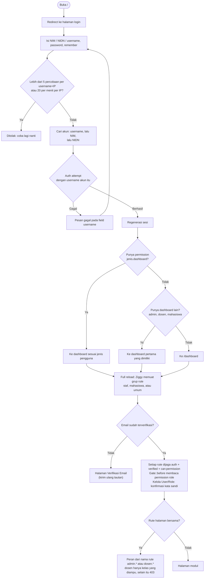
```mermaid
flowchart TD
    A(["Buka /"]) --> B["Redirect ke halaman login"]
    B --> C["Isi NIM / NIDN / username, password, remember"]
    C --> D{"Lebih dari 5 percobaan per username+IP<br/>atau 20 per menit per IP?"}
    D -- Ya --> D1["Ditolak: coba lagi nanti"]
    D -- Tidak --> E0["Cari akun: username, lalu NIM,<br/>lalu NIDN"] --> E{"Auth attempt<br/>dengan username akun itu"}
    E -- Gagal --> E1["Pesan gagal pada field username"] --> C
    E -- Berhasil --> F["Regenerasi sesi"]
    F --> G{"Punya permission<br/>jenis.dashboard?"}
    G -- Ya --> H["Ke dashboard sesuai jenis pengguna"]
    G -- Tidak --> I{"Punya dashboard lain?<br/>admin, dosen, mahasiswa"}
    I -- Ya --> H2["Ke dashboard pertama yang dimiliki"]
    I -- Tidak --> J["Ke /dashboard"]
    H --> K["Full reload: Ziggy memuat grup rute<br/>staf, mahasiswa, atau umum"]
    H2 --> K
    J --> K
    K --> V{"Email sudah terverifikasi?"}
    V -- Tidak --> V1["Halaman Verifikasi Email<br/>(kirim ulang tautan)"]
    V -- Ya --> L["Setiap rute dijaga auth + verified + can:permission<br/>Gate::before membaca permission role<br/>Kelola User/Role: konfirmasi kata sandi"]
    L --> M{"Rute halaman bersama?"}
    M -- Ya --> N["Peran dari nama rute admin.* atau dosen.*<br/>dosen hanya kelas yang diampu, selain itu 403"]
    M -- Tidak --> O["Halaman modul"]
```

## 4. Lupa kata sandi

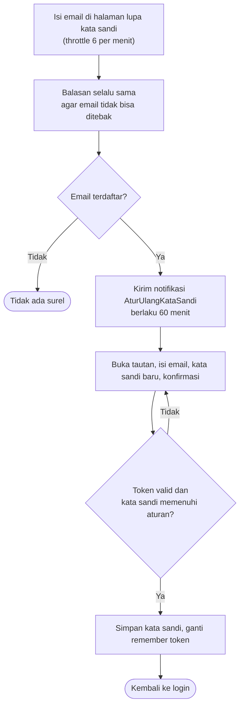
```mermaid
flowchart TD
    A["Isi email di halaman lupa kata sandi<br/>(throttle 6 per menit)"] --> B["Balasan selalu sama<br/>agar email tidak bisa ditebak"]
    B --> C{"Email terdaftar?"}
    C -- Tidak --> X(["Tidak ada surel"])
    C -- Ya --> D["Kirim notifikasi AturUlangKataSandi<br/>berlaku 60 menit"]
    D --> E["Buka tautan, isi email, kata sandi baru, konfirmasi"]
    E --> F{"Token valid dan<br/>kata sandi memenuhi aturan?"}
    F -- Tidak --> E
    F -- Ya --> G["Simpan kata sandi, ganti remember token"] --> H(["Kembali ke login"])
```

## 5. Tagihan semester dan kunci KRS

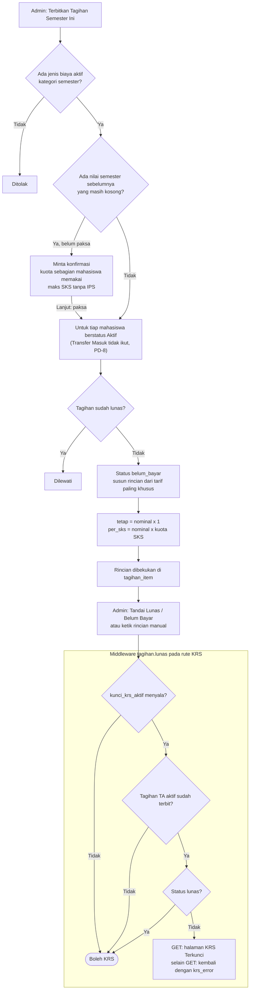
```mermaid
flowchart TD
    A["Admin: Terbitkan Tagihan Semester Ini"] --> B{"Ada jenis biaya aktif<br/>kategori semester?"}
    B -- Tidak --> B1["Ditolak"]
    B -- Ya --> C{"Ada nilai semester sebelumnya<br/>yang masih kosong?"}
    C -- "Ya, belum paksa" --> C1["Minta konfirmasi<br/>kuota sebagian mahasiswa memakai<br/>maks SKS tanpa IPS"]
    C1 -- "Lanjut: paksa" --> D
    C -- Tidak --> D["Untuk tiap mahasiswa berstatus Aktif<br/>(Transfer Masuk tidak ikut, PD-8)"]
    D --> E{"Tagihan sudah lunas?"}
    E -- Ya --> E1["Dilewati"]
    E -- Tidak --> F["Status belum_bayar<br/>susun rincian dari tarif paling khusus"]
    F --> G["tetap = nominal x 1<br/>per_sks = nominal x kuota SKS"]
    G --> H["Rincian dibekukan di tagihan_item"]

    H --> I["Admin: Tandai Lunas / Belum Bayar<br/>atau ketik rincian manual"]

    subgraph Kunci["Middleware tagihan.lunas pada rute KRS"]
        K1{"kunci_krs_aktif menyala?"} -- Tidak --> K9(["Boleh KRS"])
        K1 -- Ya --> K2{"Tagihan TA aktif sudah terbit?"}
        K2 -- Tidak --> K9
        K2 -- Ya --> K3{"Status lunas?"}
        K3 -- Ya --> K9
        K3 -- Tidak --> K4["GET: halaman KRS Terkunci<br/>selain GET: kembali dengan krs_error"]
    end
    I --> K1
```

## 6. Mengambil kelas di KRS

Urutan pemeriksaan di `KrsController::store`. Kegagalan pertama menghentikan proses.

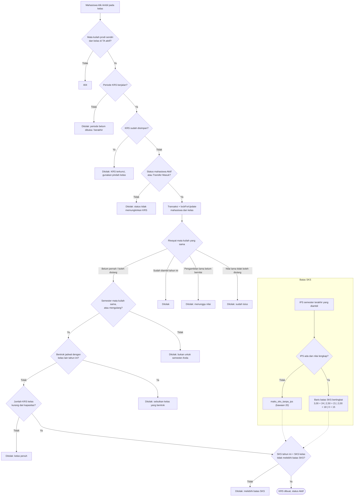
```mermaid
flowchart TD
    A["Mahasiswa klik Ambil pada kelas"] --> B{"Mata kuliah prodi sendiri<br/>dan kelas di TA aktif?"}
    B -- Tidak --> B1["404"]
    B -- Ya --> C{"Periode KRS berjalan?"}
    C -- Tidak --> X1["Ditolak: periode belum dibuka / berakhir"]
    C -- Ya --> D{"KRS sudah disimpan?"}
    D -- Ya --> X2["Ditolak: KRS terkunci, gunakan pindah kelas"]
    D -- Tidak --> E{"Status mahasiswa Aktif<br/>atau Transfer Masuk?"}
    E -- Tidak --> X3["Ditolak: status tidak memungkinkan KRS"]
    E -- Ya --> F["Transaksi + lockForUpdate<br/>mahasiswa dan kelas"]
    F --> G{"Riwayat mata kuliah yang sama"}
    G -- "Sudah diambil tahun ini" --> X4["Ditolak"]
    G -- "Pengambilan lama belum bernilai" --> X5["Ditolak: menunggu nilai"]
    G -- "Nilai lama tidak boleh diulang" --> X6["Ditolak: sudah lulus"]
    G -- "Belum pernah / boleh diulang" --> H{"Semester mata kuliah sama,<br/>atau mengulang?"}
    H -- Tidak --> X7["Ditolak: bukan untuk semester Anda"]
    H -- Ya --> I{"Bentrok jadwal dengan<br/>kelas lain tahun ini?"}
    I -- Ya --> X8["Ditolak: sebutkan kelas yang bentrok"]
    I -- Tidak --> J{"Jumlah KRS kelas<br/>kurang dari kapasitas?"}
    J -- Tidak --> X9["Ditolak: kelas penuh"]
    J -- Ya --> K{"SKS tahun ini + SKS kelas<br/>tidak melebihi batas SKS?"}
    K -- Tidak --> X10["Ditolak: melebihi batas SKS"]
    K -- Ya --> L(["KRS dibuat, status Aktif"])

    subgraph Batas["Batas SKS"]
        S1["IPS semester terakhir yang diambil"] --> S2{"IPS ada dan nilai lengkap?"}
        S2 -- Tidak --> S3["maks_sks_tanpa_ips (bawaan 20)"]
        S2 -- Ya --> S4["Baris batas SKS bertingkat<br/>3,00 = 24 | 2,50 = 21 | 2,00 = 18 | 0 = 15"]
    end
    S3 -.-> K
    S4 -.-> K
```

## 7. Batal dan simpan KRS

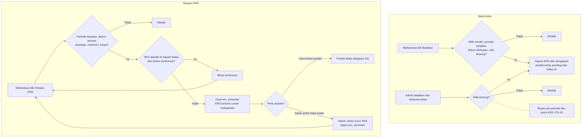
```mermaid
flowchart TD
    subgraph Batal["Batal kelas"]
        A1["Mahasiswa klik Batalkan"] --> A2{"Milik sendiri, periode berjalan,<br/>belum disimpan, nilai kosong?"}
        A2 -- Tidak --> A3["Ditolak"]
        A2 -- Ya --> A4["Hapus KRS dan pengajuan<br/>pindah kelas pending dari kelas itu"]
        B1["Admin batalkan dari halaman kelas"] --> B2{"Nilai kosong?"}
        B2 -- Tidak --> B3["Ditolak"]
        B2 -- Ya --> A4
        B2 -.- B4["Tanpa cek periode dan kunci KRS, PD-16"]
    end

    subgraph Simpan["Simpan KRS"]
        C1["Mahasiswa klik Simpan KRS"] --> C2{"Periode berjalan, belum pernah<br/>disimpan, minimal 1 kelas?"}
        C2 -- Tidak --> C3["Ditolak"]
        C2 -- Ya --> C4{"SKS diambil di bawah batas<br/>dan belum konfirmasi?"}
        C4 -- Ya --> C5["Minta konfirmasi"] --> C1
        C4 -- Tidak --> C6["Catat krs_semester<br/>KRS terkunci untuk mahasiswa"]
        C6 --> C7{"Perlu diubah?"}
        C7 -- "Ganti kelas paralel" --> C8["Pindah kelas (diagram 26)"]
        C7 -- "Salah ambil mata kuliah" --> C9["Admin: Buka kunci KRS<br/>hapus krs_semester"]
        C9 --> C1
    end
```

## 8. Kelas, jadwal, dan pertemuan

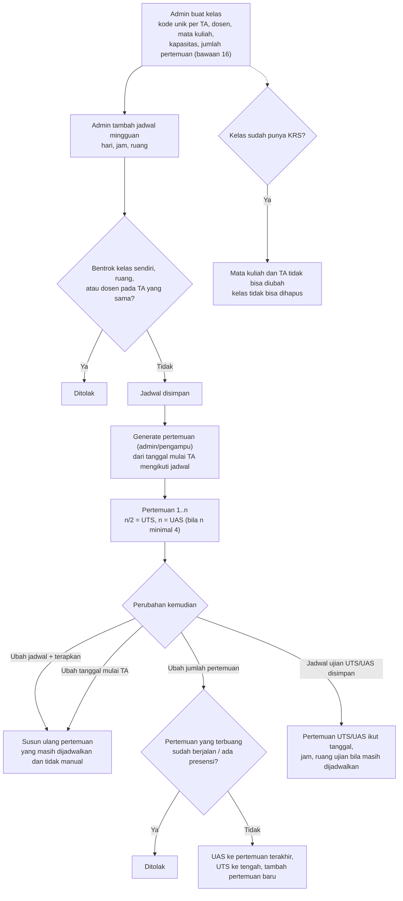
```mermaid
flowchart TD
    A["Admin buat kelas<br/>kode unik per TA, dosen, mata kuliah,<br/>kapasitas, jumlah pertemuan (bawaan 16)"] --> B["Admin tambah jadwal mingguan<br/>hari, jam, ruang"]
    B --> C{"Bentrok kelas sendiri, ruang,<br/>atau dosen pada TA yang sama?"}
    C -- Ya --> C1["Ditolak"]
    C -- Tidak --> D["Jadwal disimpan"]
    D --> E["Generate pertemuan (admin/pengampu)<br/>dari tanggal mulai TA mengikuti jadwal"]
    E --> F["Pertemuan 1..n<br/>n/2 = UTS, n = UAS (bila n minimal 4)"]
    F --> G{"Perubahan kemudian"}
    G -- "Ubah jadwal + terapkan" --> H["Susun ulang pertemuan<br/>yang masih dijadwalkan dan tidak manual"]
    G -- "Ubah tanggal mulai TA" --> H
    G -- "Ubah jumlah pertemuan" --> I{"Pertemuan yang terbuang<br/>sudah berjalan / ada presensi?"}
    I -- Ya --> I1["Ditolak"]
    I -- Tidak --> I2["UAS ke pertemuan terakhir,<br/>UTS ke tengah, tambah pertemuan baru"]
    G -- "Jadwal ujian UTS/UAS disimpan" --> J["Pertemuan UTS/UAS ikut tanggal,<br/>jam, ruang ujian bila masih dijadwalkan"]
    A -.-> K{"Kelas sudah punya KRS?"}
    K -- Ya --> K1["Mata kuliah dan TA tidak bisa diubah<br/>kelas tidak bisa dihapus"]
```

## 9. Status pertemuan

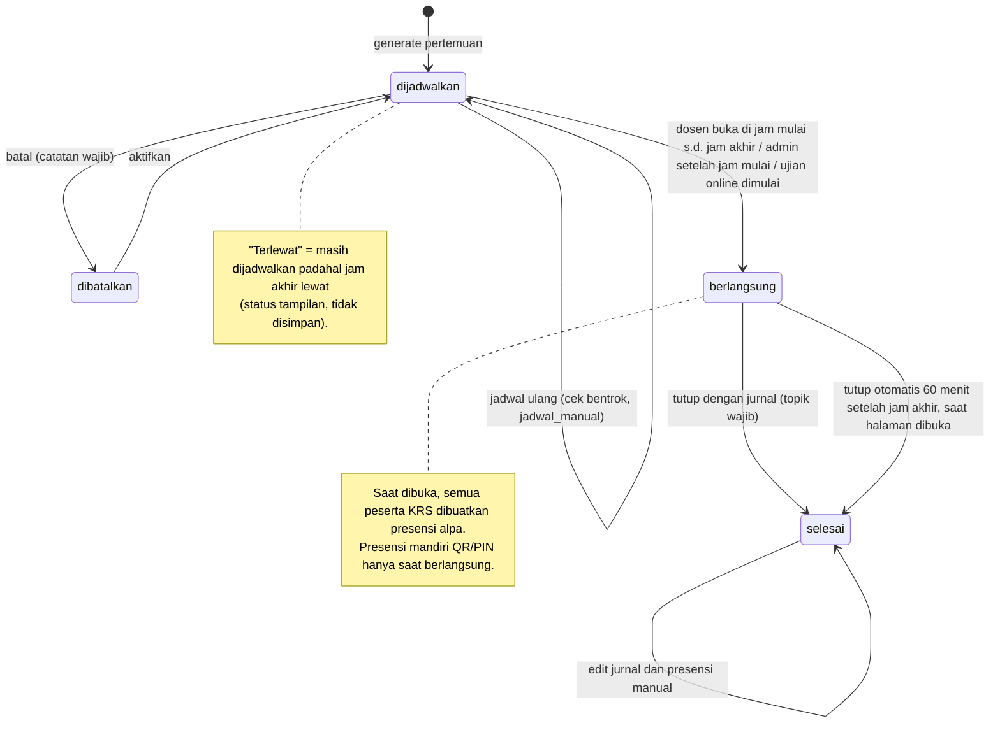
```mermaid
stateDiagram-v2
    [*] --> dijadwalkan: generate pertemuan
    dijadwalkan --> dijadwalkan: jadwal ulang (cek bentrok, jadwal_manual)
    dijadwalkan --> dibatalkan: batal (catatan wajib)
    dibatalkan --> dijadwalkan: aktifkan
    dijadwalkan --> berlangsung: dosen buka di jam mulai s.d. jam akhir / admin setelah jam mulai / ujian online dimulai
    berlangsung --> selesai: tutup dengan jurnal (topik wajib)
    berlangsung --> selesai: tutup otomatis 60 menit setelah jam akhir, saat halaman dibuka
    selesai --> selesai: edit jurnal dan presensi manual
    note right of berlangsung
        Saat dibuka, semua peserta KRS dibuatkan presensi alpa.
        Presensi mandiri QR/PIN hanya saat berlangsung.
    end note
    note right of dijadwalkan
        "Terlewat" = masih dijadwalkan padahal jam akhir lewat
        (status tampilan, tidak disimpan).
    end note
```

## 10. Presensi mandiri QR/PIN

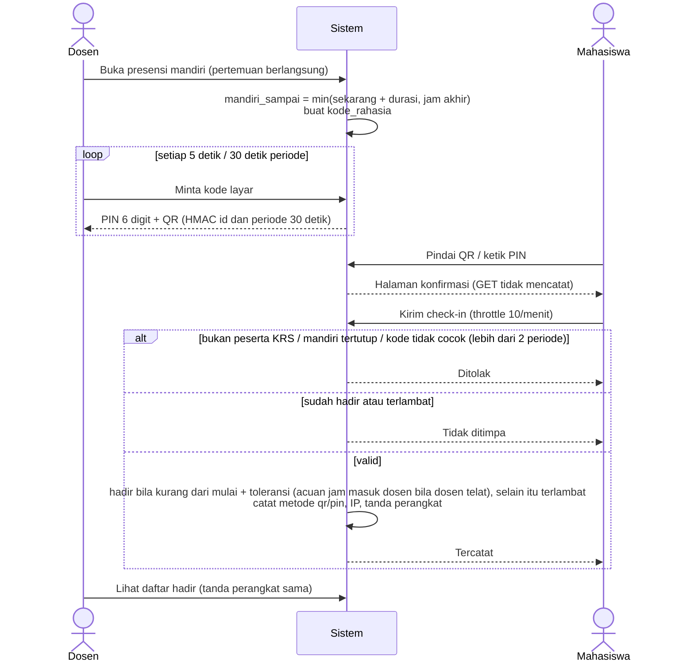
```mermaid
sequenceDiagram
    actor D as Dosen
    participant S as Sistem
    actor M as Mahasiswa

    D->>S: Buka presensi mandiri (pertemuan berlangsung)
    S->>S: mandiri_sampai = min(sekarang + durasi, jam akhir)<br/>buat kode_rahasia
    loop setiap 5 detik / 30 detik periode
        D->>S: Minta kode layar
        S-->>D: PIN 6 digit + QR (HMAC id dan periode 30 detik)
    end
    M->>S: Pindai QR / ketik PIN
    S-->>M: Halaman konfirmasi (GET tidak mencatat)
    M->>S: Kirim check-in (throttle 10/menit)
    alt bukan peserta KRS / mandiri tertutup / kode tidak cocok (lebih dari 2 periode)
        S-->>M: Ditolak
    else sudah hadir atau terlambat
        S-->>M: Tidak ditimpa
    else valid
        S->>S: hadir bila kurang dari mulai + toleransi (acuan jam masuk dosen bila dosen telat), selain itu terlambat<br/>catat metode qr/pin, IP, tanda perangkat
        S-->>M: Tercatat
    end
    D->>S: Lihat daftar hadir (tanda perangkat sama)
```

## 11. Pengajuan izin/sakit

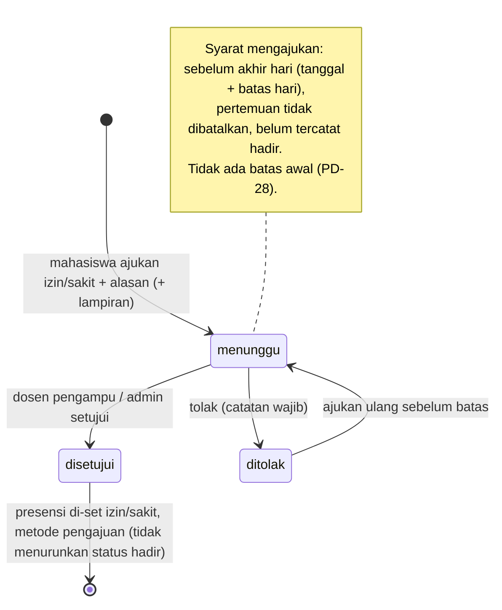
```mermaid
stateDiagram-v2
    [*] --> menunggu: mahasiswa ajukan izin/sakit + alasan (+ lampiran)
    menunggu --> disetujui: dosen pengampu / admin setujui
    menunggu --> ditolak: tolak (catatan wajib)
    ditolak --> menunggu: ajukan ulang sebelum batas
    disetujui --> [*]: presensi di-set izin/sakit, metode pengajuan (tidak menurunkan status hadir)
    note left of menunggu
        Syarat mengajukan: sebelum akhir hari (tanggal + batas hari),
        pertemuan tidak dibatalkan, belum tercatat hadir.
        Tidak ada batas awal (PD-28).
    end note
```

## 12. Pengumpulan dan penilaian tugas

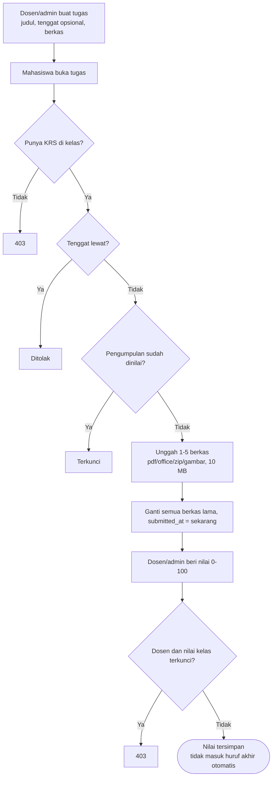
```mermaid
flowchart TD
    A["Dosen/admin buat tugas<br/>judul, tenggat opsional, berkas"] --> B["Mahasiswa buka tugas"]
    B --> C{"Punya KRS di kelas?"}
    C -- Tidak --> C1["403"]
    C -- Ya --> D{"Tenggat lewat?"}
    D -- Ya --> D1["Ditolak"]
    D -- Tidak --> E{"Pengumpulan sudah dinilai?"}
    E -- Ya --> E1["Terkunci"]
    E -- Tidak --> F["Unggah 1-5 berkas<br/>pdf/office/zip/gambar, 10 MB"]
    F --> G["Ganti semua berkas lama, submitted_at = sekarang"]
    G --> H["Dosen/admin beri nilai 0-100"]
    H --> I{"Dosen dan nilai kelas terkunci?"}
    I -- Ya --> I1["403"]
    I -- Tidak --> J(["Nilai tersimpan<br/>tidak masuk huruf akhir otomatis"])
```

## 13. Mengerjakan quiz

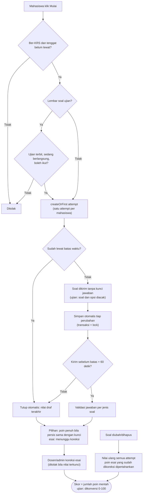
```mermaid
flowchart TD
    A["Mahasiswa klik Mulai"] --> B{"Ber-KRS dan tenggat belum lewat?"}
    B -- Tidak --> B1["Ditolak"]
    B -- Ya --> C{"Lembar soal ujian?"}
    C -- Ya --> C2{"Ujian terbit, sedang berlangsung,<br/>boleh ikut?"}
    C2 -- Tidak --> B1
    C2 -- Ya --> D
    C -- Tidak --> D["createOrFirst attempt<br/>(satu attempt per mahasiswa)"]
    D --> E{"Sudah lewat batas waktu?"}
    E -- Ya --> Z["Tutup otomatis: nilai draf terakhir"]
    E -- Tidak --> F["Soal dikirim tanpa kunci jawaban<br/>(ujian: soal dan opsi diacak)"]
    F --> G["Simpan otomatis tiap perubahan<br/>(transaksi + lock)"]
    G --> H{"Kirim sebelum batas + 60 detik?"}
    H -- Tidak --> Z
    H -- Ya --> I["Validasi jawaban per jenis soal"]
    I --> J["Pilihan: poin penuh bila persis sama dengan kunci<br/>esai: menunggu koreksi"]
    Z --> J
    J --> K["Dosen/admin koreksi esai<br/>(ditolak bila nilai terkunci)"]
    K --> L(["Skor = jumlah poin mentah<br/>ujian: dikonversi 0-100"])
    M["Soal diubah/dihapus"] --> N["Nilai ulang semua attempt<br/>poin esai yang sudah dikoreksi dipertahankan"] --> L
```

## 14. Jadwal ujian UTS/UAS

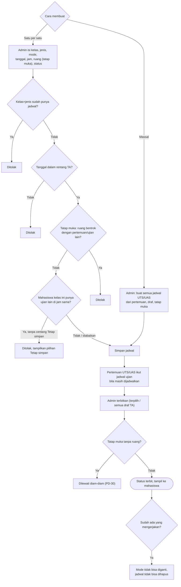
```mermaid
flowchart TD
    A{"Cara membuat"} -- "Satu per satu" --> B["Admin isi kelas, jenis, mode,<br/>tanggal, jam, ruang (tatap muka), status"]
    A -- "Massal" --> M["Admin: buat semua jadwal UTS/UAS<br/>dari pertemuan, draf, tatap muka"]
    B --> C{"Kelas+jenis sudah punya jadwal?"}
    C -- Ya --> C1["Ditolak"]
    C -- Tidak --> D{"Tanggal dalam rentang TA?"}
    D -- Tidak --> D1["Ditolak"]
    D -- Ya --> E{"Tatap muka: ruang bentrok<br/>dengan pertemuan/ujian lain?"}
    E -- Ya --> E1["Ditolak"]
    E -- Tidak --> F{"Mahasiswa kelas ini punya<br/>ujian lain di jam sama?"}
    F -- "Ya, tanpa centang Tetap simpan" --> F1["Ditolak, tampilkan pilihan Tetap simpan"]
    F -- "Tidak / diabaikan" --> G["Simpan jadwal"]
    M --> G
    G --> H["Pertemuan UTS/UAS ikut jadwal ujian<br/>bila masih dijadwalkan"]
    H --> I["Admin terbitkan (terpilih / semua draf TA)"]
    I --> J{"Tatap muka tanpa ruang?"}
    J -- Ya --> J1["Dilewati diam-diam (PD-30)"]
    J -- Tidak --> K(["Status terbit, tampil ke mahasiswa"])
    K --> L{"Sudah ada yang mengerjakan?"}
    L -- Ya --> L1["Mode tidak bisa diganti,<br/>jadwal tidak bisa dihapus"]
```

## 15. Mengerjakan dan menilai ujian

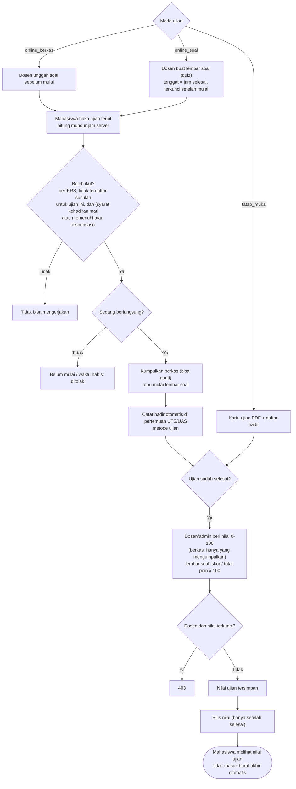
```mermaid
flowchart TD
    A{"Mode ujian"} -- online_berkas --> B["Dosen unggah soal sebelum mulai"]
    A -- online_soal --> C["Dosen buat lembar soal (quiz)<br/>tenggat = jam selesai, terkunci setelah mulai"]
    A -- tatap_muka --> D["Kartu ujian PDF + daftar hadir"]

    B --> E["Mahasiswa buka ujian terbit<br/>hitung mundur jam server"]
    C --> E
    E --> F{"Boleh ikut?<br/>ber-KRS, tidak terdaftar susulan<br/>untuk ujian ini, dan (syarat kehadiran mati<br/>atau memenuhi atau dispensasi)"}
    F -- Tidak --> F1["Tidak bisa mengerjakan"]
    F -- Ya --> G{"Sedang berlangsung?"}
    G -- Tidak --> G1["Belum mulai / waktu habis: ditolak"]
    G -- Ya --> H["Kumpulkan berkas (bisa ganti)<br/>atau mulai lembar soal"]
    H --> I["Catat hadir otomatis di pertemuan UTS/UAS<br/>metode ujian"]

    D --> J
    I --> J{"Ujian sudah selesai?"}
    J -- Ya --> K["Dosen/admin beri nilai 0-100<br/>(berkas: hanya yang mengumpulkan)<br/>lembar soal: skor / total poin x 100"]
    K --> L{"Dosen dan nilai terkunci?"}
    L -- Ya --> L1["403"]
    L -- Tidak --> N["Nilai ujian tersimpan"]
    N --> O["Rilis nilai (hanya setelah selesai)"]
    O --> P(["Mahasiswa melihat nilai ujian<br/>tidak masuk huruf akhir otomatis"])
```

## 16. Nilai akhir dan kunci nilai

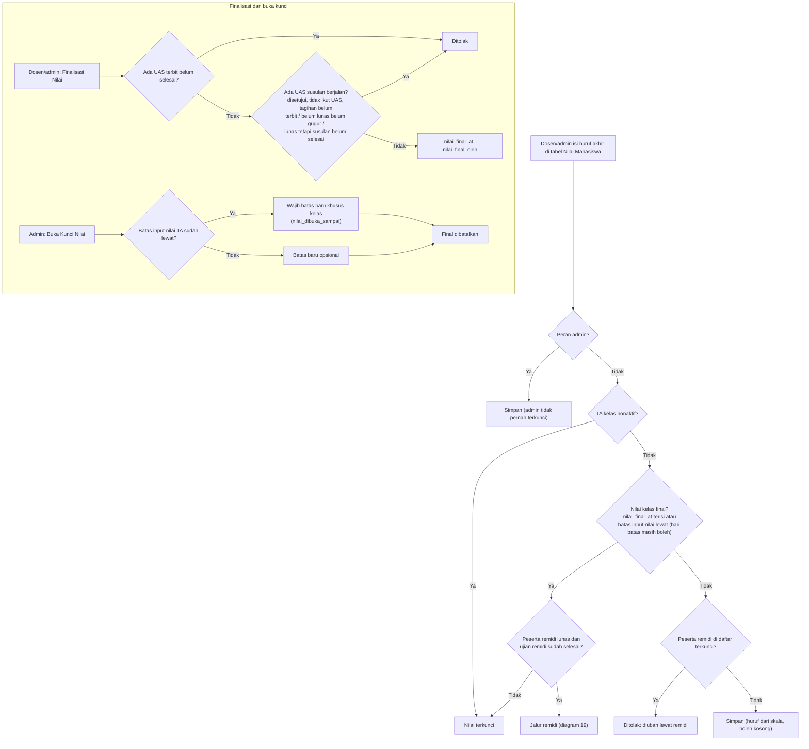
```mermaid
flowchart TD
    A["Dosen/admin isi huruf akhir di tabel Nilai Mahasiswa"] --> B{"Peran admin?"}
    B -- Ya --> Z["Simpan (admin tidak pernah terkunci)"]
    B -- Tidak --> C{"TA kelas nonaktif?"}
    C -- Ya --> X["Nilai terkunci"]
    C -- Tidak --> D{"Nilai kelas final?<br/>nilai_final_at terisi atau<br/>batas input nilai lewat (hari batas masih boleh)"}
    D -- Ya --> R{"Peserta remidi lunas dan<br/>ujian remidi sudah selesai?"}
    R -- Ya --> RR["Jalur remidi (diagram 19)"]
    R -- Tidak --> X
    D -- Tidak --> P{"Peserta remidi di daftar terkunci?"}
    P -- Ya --> X2["Ditolak: diubah lewat remidi"]
    P -- Tidak --> Z2["Simpan (huruf dari skala, boleh kosong)"]

    subgraph Final["Finalisasi dan buka kunci"]
        F1["Dosen/admin: Finalisasi Nilai"] --> F2{"Ada UAS terbit belum selesai?"}
        F2 -- Ya --> F3["Ditolak"]
        F2 -- Tidak --> F5{"Ada UAS susulan berjalan?<br/>disetujui, tidak ikut UAS, tagihan belum<br/>terbit / belum lunas belum gugur /<br/>lunas tetapi susulan belum selesai"}
        F5 -- Ya --> F3
        F5 -- Tidak --> F4["nilai_final_at, nilai_final_oleh"]
        G1["Admin: Buka Kunci Nilai"] --> G2{"Batas input nilai TA sudah lewat?"}
        G2 -- Ya --> G3["Wajib batas baru khusus kelas<br/>(nilai_dibuka_sampai)"]
        G2 -- Tidak --> G4["Batas baru opsional"]
        G3 --> G5["Final dibatalkan"]
        G4 --> G5
    end
```

## 17. Remidi dari awal sampai akhir

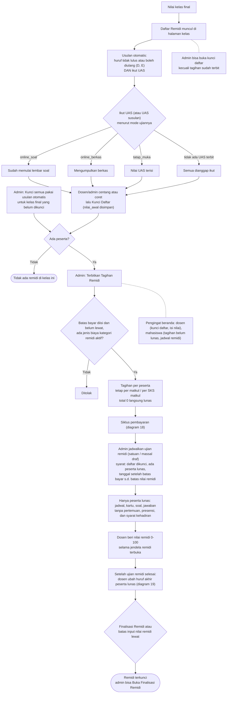
```mermaid
flowchart TD
    A["Nilai kelas final"] --> B["Daftar Remidi muncul di halaman kelas"]
    B --> C["Usulan otomatis:<br/>huruf tidak lulus atau boleh diulang (D, E)<br/>DAN ikut UAS"]
    C --> C1{"Ikut UAS (atau UAS susulan)<br/>menurut mode ujiannya"}
    C1 -- "online_soal" --> C2["Sudah memulai lembar soal"]
    C1 -- "online_berkas" --> C3["Mengumpulkan berkas"]
    C1 -- "tatap_muka" --> C4["Nilai UAS terisi"]
    C1 -- "tidak ada UAS terbit" --> C5["Semua dianggap ikut"]
    C2 --> D
    C3 --> D
    C4 --> D
    C5 --> D
    D["Dosen/admin centang atau coret<br/>lalu Kunci Daftar (nilai_awal disimpan)"]
    D2["Admin: Kunci semua pakai usulan otomatis<br/>untuk kelas final yang belum dikunci"] --> E
    D --> E{"Ada peserta?"}
    E -- Tidak --> E1(["Tidak ada remidi di kelas ini"])
    E -- Ya --> F["Admin: Terbitkan Tagihan Remidi"]
    F --> F1{"Batas bayar diisi dan belum lewat,<br/>ada jenis biaya kategori remidi aktif?"}
    F1 -- Tidak --> F2["Ditolak"]
    F1 -- Ya --> G["Tagihan per peserta<br/>tetap per matkul / per SKS matkul<br/>total 0 langsung lunas"]
    G --> H["Siklus pembayaran (diagram 18)"]
    H --> I["Admin jadwalkan ujian remidi (satuan / massal draf)<br/>syarat: daftar dikunci, ada peserta lunas,<br/>tanggal setelah batas bayar s.d. batas nilai remidi"]
    I --> J["Hanya peserta lunas: jadwal, kartu, soal, jawaban<br/>tanpa pertemuan, presensi, dan syarat kehadiran"]
    J --> K["Dosen beri nilai remidi 0-100<br/>selama jendela remidi terbuka"]
    K --> L["Setelah ujian remidi selesai:<br/>dosen ubah huruf akhir peserta lunas (diagram 19)"]
    L --> M{"Finalisasi Remidi atau<br/>batas input nilai remidi lewat"}
    M --> N(["Remidi terkunci<br/>admin bisa Buka Finalisasi Remidi"])

    B -.- P["Admin bisa buka kunci daftar<br/>kecuali tagihan sudah terbit"]
    F -.- Q["Pengingat beranda: dosen (kunci daftar, isi nilai),<br/>mahasiswa (tagihan belum lunas, jadwal remidi)"]
```

## 18. Status tagihan remidi

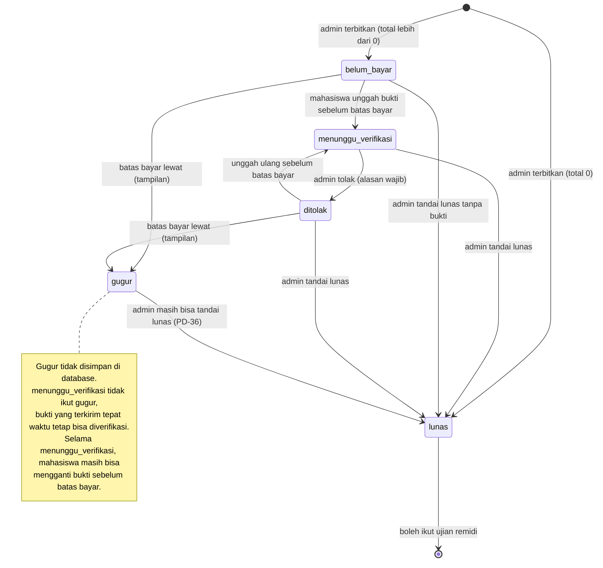
```mermaid
stateDiagram-v2
    [*] --> belum_bayar: admin terbitkan (total lebih dari 0)
    [*] --> lunas: admin terbitkan (total 0)
    belum_bayar --> menunggu_verifikasi: mahasiswa unggah bukti sebelum batas bayar
    ditolak --> menunggu_verifikasi: unggah ulang sebelum batas bayar
    menunggu_verifikasi --> lunas: admin tandai lunas
    menunggu_verifikasi --> ditolak: admin tolak (alasan wajib)
    belum_bayar --> lunas: admin tandai lunas tanpa bukti
    ditolak --> lunas: admin tandai lunas
    belum_bayar --> gugur: batas bayar lewat (tampilan)
    ditolak --> gugur: batas bayar lewat (tampilan)
    gugur --> lunas: admin masih bisa tandai lunas (PD-36)
    lunas --> [*]: boleh ikut ujian remidi
    note right of gugur
        Gugur tidak disimpan di database.
        menunggu_verifikasi tidak ikut gugur,
        bukti yang terkirim tepat waktu tetap bisa diverifikasi.
        Selama menunggu_verifikasi, mahasiswa masih bisa
        mengganti bukti sebelum batas bayar.
    end note
```

## 19. Huruf akhir peserta remidi

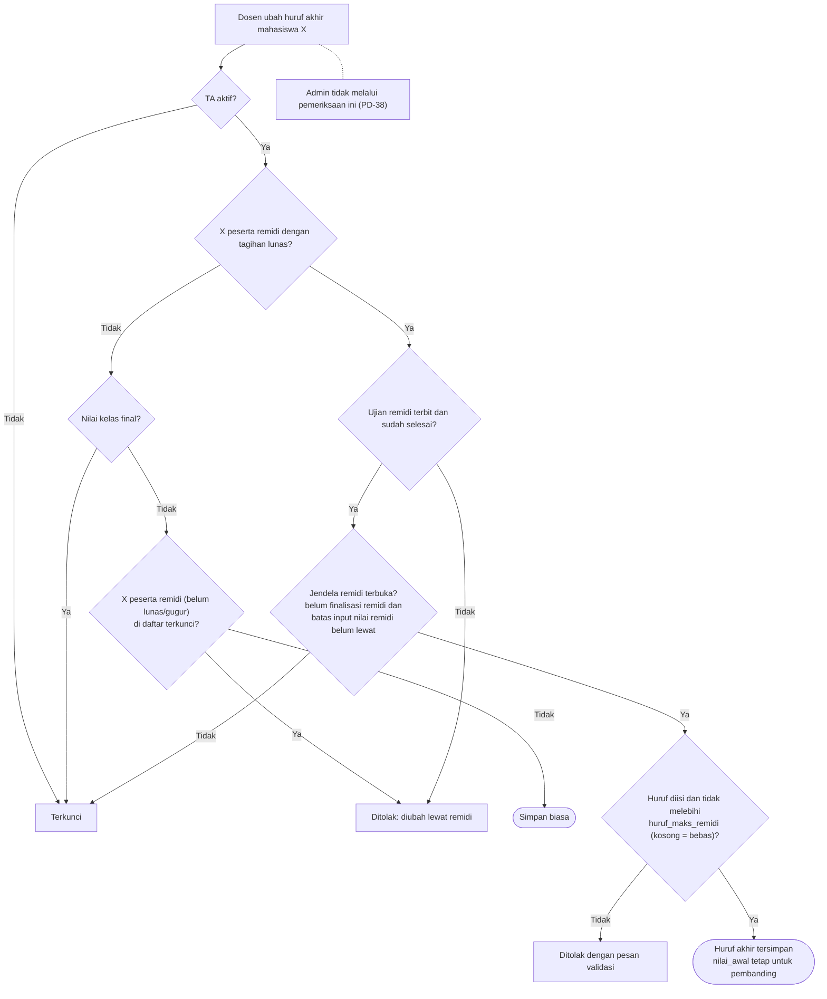
```mermaid
flowchart TD
    A["Dosen ubah huruf akhir mahasiswa X"] --> B{"TA aktif?"}
    B -- Tidak --> T["Terkunci"]
    B -- Ya --> C{"X peserta remidi dengan tagihan lunas?"}
    C -- Tidak --> N{"Nilai kelas final?"}
    N -- Ya --> T
    N -- Tidak --> N2{"X peserta remidi (belum lunas/gugur)<br/>di daftar terkunci?"}
    N2 -- Ya --> T2["Ditolak: diubah lewat remidi"]
    N2 -- Tidak --> OK1(["Simpan biasa"])
    C -- Ya --> D{"Ujian remidi terbit dan sudah selesai?"}
    D -- Tidak --> T2
    D -- Ya --> E{"Jendela remidi terbuka?<br/>belum finalisasi remidi dan<br/>batas input nilai remidi belum lewat"}
    E -- Tidak --> T
    E -- Ya --> F{"Huruf diisi dan tidak melebihi<br/>huruf_maks_remidi (kosong = bebas)?"}
    F -- Tidak --> F1["Ditolak dengan pesan validasi"]
    F -- Ya --> OK2(["Huruf akhir tersimpan<br/>nilai_awal tetap untuk pembanding"])
    A -.- G["Admin tidak melalui pemeriksaan ini (PD-38)"]
```

## 20. Ujian susulan dari awal sampai akhir

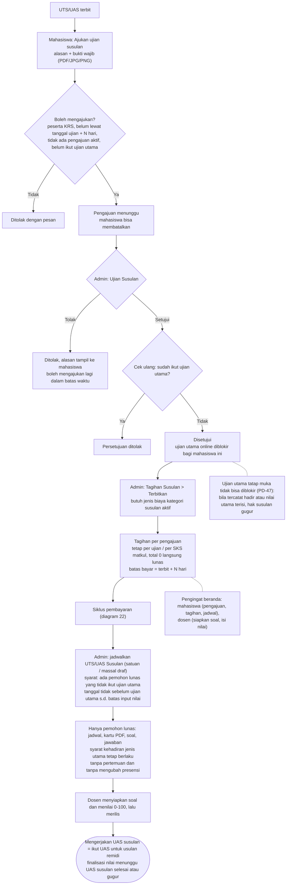
```mermaid
flowchart TD
    A["UTS/UAS terbit"] --> B["Mahasiswa: Ajukan ujian susulan<br/>alasan + bukti wajib (PDF/JPG/PNG)"]
    B --> C{"Boleh mengajukan?<br/>peserta KRS, belum lewat tanggal ujian + N hari,<br/>tidak ada pengajuan aktif, belum ikut ujian utama"}
    C -- Tidak --> C1["Ditolak dengan pesan"]
    C -- Ya --> D["Pengajuan menunggu<br/>mahasiswa bisa membatalkan"]
    D --> E{"Admin: Ujian Susulan"}
    E -- Tolak --> E1["Ditolak, alasan tampil ke mahasiswa<br/>boleh mengajukan lagi dalam batas waktu"]
    E -- Setujui --> F{"Cek ulang: sudah ikut ujian utama?"}
    F -- Ya --> F1["Persetujuan ditolak"]
    F -- Tidak --> G["Disetujui<br/>ujian utama online diblokir bagi mahasiswa ini"]
    G --> H["Admin: Tagihan Susulan > Terbitkan<br/>butuh jenis biaya kategori susulan aktif"]
    H --> I["Tagihan per pengajuan<br/>tetap per ujian / per SKS matkul, total 0 langsung lunas<br/>batas bayar = terbit + N hari"]
    I --> J["Siklus pembayaran (diagram 22)"]
    J --> K["Admin: jadwalkan UTS/UAS Susulan (satuan / massal draf)<br/>syarat: ada pemohon lunas yang tidak ikut ujian utama<br/>tanggal tidak sebelum ujian utama s.d. batas input nilai"]
    K --> L["Hanya pemohon lunas: jadwal, kartu PDF, soal, jawaban<br/>syarat kehadiran jenis utama tetap berlaku<br/>tanpa pertemuan dan tanpa mengubah presensi"]
    L --> M["Dosen menyiapkan soal dan menilai 0-100, lalu merilis"]
    M --> N(["Mengerjakan UAS susulan = ikut UAS untuk usulan remidi<br/>finalisasi nilai menunggu UAS susulan selesai atau gugur"])

    G -.- P["Ujian utama tatap muka tidak bisa diblokir (PD-47):<br/>bila tercatat hadir atau nilai utama terisi, hak susulan gugur"]
    I -.- Q["Pengingat beranda: mahasiswa (pengajuan, tagihan, jadwal),<br/>dosen (siapkan soal, isi nilai)"]
```

## 21. Status pengajuan susulan

```mermaid
stateDiagram-v2
    state "dibatalkan (tampilan)" as dibatalkan_tampilan
    state "gugur (tampilan)" as gugur_tampilan
    [*] --> menunggu: mahasiswa mengajukan dengan bukti
    menunggu --> dibatalkan: mahasiswa membatalkan
    menunggu --> ditolak: admin tolak (alasan wajib)
    menunggu --> disetujui: admin setujui (dicek ulang belum ikut ujian utama)
    ditolak --> [*]: boleh mengajukan lagi dalam batas waktu
    dibatalkan --> [*]: boleh mengajukan lagi dalam batas waktu
    menunggu --> dibatalkan_tampilan: ternyata ikut ujian utama
    disetujui --> gugur_tampilan: tercatat ikut ujian utama (tatap muka)
    disetujui --> [*]: tagihan lunas, ikut jadwal susulan
    note right of gugur_tampilan
        Status tampilan dihitung saat ditampilkan,
        tidak disimpan di database.
    end note
```

## 22. Status tagihan susulan

```mermaid
stateDiagram-v2
    state "lunas, ditandai sudah ikut ujian utama" as lunas_ditandai
    [*] --> belum_bayar: admin terbitkan (total lebih dari 0)
    [*] --> lunas: admin terbitkan (total 0)
    belum_bayar --> menunggu_verifikasi: mahasiswa unggah bukti sebelum batas bayar
    ditolak --> menunggu_verifikasi: unggah ulang sebelum batas bayar
    menunggu_verifikasi --> lunas: admin tandai lunas
    menunggu_verifikasi --> ditolak: admin tolak (alasan wajib)
    belum_bayar --> lunas: admin tandai lunas tanpa bukti
    belum_bayar --> gugur: batas bayar tagihan lewat (tampilan)
    ditolak --> gugur: batas bayar tagihan lewat (tampilan)
    belum_bayar --> dibatalkan: mahasiswa ikut ujian utama (tampilan)
    menunggu_verifikasi --> dibatalkan: mahasiswa ikut ujian utama (tampilan)
    lunas --> lunas_ditandai: ikut ujian utama, refund di luar sistem (PD-46)
    lunas --> [*]: menjadi peserta ujian susulan
    note right of dibatalkan
        Dibatalkan: bukti tidak bisa diunggah
        dan admin tidak bisa menandai lunas.
    end note
```

## 23. Tugas akhir sampai wisuda

```mermaid
flowchart TD
    A["Mahasiswa mengambil mata kuliah TA/Skripsi<br/>di KRS tahun aktif"] --> B["Pengajuan TA: judul, bidang, ringkasan,<br/>usulan pembimbing, proposal"]
    B --> C{"Admin: TA & Wisuda"}
    C -- "Perbaikan" --> B
    C -- "Tolak" --> B0["Form baru"]
    B0 --> B
    C -- "Setujui + sahkan judul,<br/>tetapkan pembimbing (maks 2)" --> D["TA berjalan"]
    D --> E{"Syarat pendadaran:<br/>SKS >= minimal, tanpa nilai E,<br/>semua mata kuliah lain dinilai"}
    E -- "Belum" --> E1["Form terkunci + daftar syarat (PD-55)"]
    E -- "Ya" --> F["Daftar pendadaran: judul final, naskah,<br/>lembar persetujuan, bukti bayar"]
    F --> G{"Salah satu pembimbing"}
    G -- "Perbaikan / tolak" --> F
    G -- "Setujui" --> H{"Admin: setujui + jadwalkan<br/>tanggal, jam, ruang, 3 penguji"}
    H -- "Ruang terpakai / penguji menguji<br/>pendadaran lain" --> H1["Ditolak, ubah jadwal"]
    H -- "Penguji sedang mengajar" --> H2["Peringatan, Tetap Simpan"]
    H2 --> I
    H -- "Perbaikan (kembali ke admin)" --> F
    H -- "Tidak bentrok" --> I["Pendadaran dijadwalkan<br/>surat tugas + undangan (PDF) bernomor"]
    I --> J["Tiap penguji menilai 0-100 sejak jam mulai"]
    J --> K{"Ketua penguji: rata-rata -> huruf<br/>(angka minimal skala nilai)"}
    K -- "Lulus" --> L["TA selesai, huruf masuk KRS mata kuliah TA"]
    K -- "Lulus dengan revisi" --> K1["Mahasiswa unggah naskah revisi"]
    K1 --> K2{"Ketua"}
    K2 -- "Kembalikan" --> K1
    K2 -- "Sahkan" --> L
    K -- "Tidak lulus" --> F
    L --> M{"Syarat wisuda + periode dibuka dan kuota tersisa"}
    M -- "Ya" --> N["Daftar wisuda: periode, data ijazah,<br/>toga, pas foto, naskah final, bebas pinjam, bukti bayar"]
    N --> O{"Admin (kuota dicek ulang)"}
    O -- "Perbaikan / tolak" --> N
    O -- "Setujui" --> P["Daftar Mahasiswa Wisuda per periode"]
    P --> Q(["Generate SKL: IPK, predikat, tanggal lulus dibekukan<br/>status mahasiswa menjadi Lulus"])

    F -.- R["Biaya pendadaran/wisuda hanya informasi di Biaya Kuliah;<br/>bukti bayar diunggah di form"]
```

## 24. Status pengajuan TA, pendadaran, dan wisuda

```mermaid
stateDiagram-v2
    state "menunggu (admin)" as menunggu
    [*] --> menunggu_pembimbing: mahasiswa mengirim (pendadaran)
    [*] --> menunggu: mahasiswa mengirim (TA, wisuda)
    menunggu_pembimbing --> menunggu: salah satu pembimbing setujui
    menunggu_pembimbing --> perlu_perbaikan: pembimbing minta perbaikan
    menunggu_pembimbing --> ditolak: pembimbing tolak
    menunggu --> perlu_perbaikan: admin minta perbaikan
    menunggu --> ditolak: admin tolak
    menunggu --> disetujui: admin setujui (syarat dicek ulang)
    perlu_perbaikan --> menunggu_pembimbing: kirim ulang (perbaikan dari pembimbing)
    perlu_perbaikan --> menunggu: kirim ulang (perbaikan dari admin / TA / wisuda)
    ditolak --> [*]: form baru
    disetujui --> [*]
    note right of menunggu
        Selama menunggu mahasiswa tidak bisa
        membatalkan atau mengisi form baru.
    end note
```

## 25. Status pendadaran

```mermaid
stateDiagram-v2
    [*] --> dijadwalkan: admin setujui + jadwalkan (surat bernomor)
    dijadwalkan --> dijadwalkan: penguji mengisi / mengubah nilai sejak jam mulai
    dijadwalkan --> selesai: ketua tetapkan lulus
    dijadwalkan --> revisi: ketua tetapkan lulus dengan revisi
    dijadwalkan --> tidak_lulus: ketua tetapkan tidak lulus (wajib bila huruf tidak lulus)
    revisi --> revisi: ketua kembalikan naskah revisi
    revisi --> selesai: ketua sahkan revisi
    selesai --> [*]: TA selesai, huruf masuk KRS mata kuliah TA
    tidak_lulus --> [*]: mahasiswa mendaftar ulang
```

## 26. Pindah kelas

```mermaid
flowchart TD
    A["Mahasiswa buka Pindah Kelas"] --> B{"Formulir dibuka admin?"}
    B -- Tidak --> B1["Hanya riwayat, kirim ditolak 403"]
    B -- Ya --> C["Pilih kelas asal (KRS Aktif, TA aktif),<br/>kelas tujuan, alasan"]
    C --> D{"Tujuan beda kelas, mata kuliah sama,<br/>TA sama, tidak ada pending untuk kelas asal ini?"}
    D -- Tidak --> D1["Ditolak"]
    D -- Ya --> E["Pengajuan pending<br/>(kapasitas dan bentrok belum dicek, PD-39)"]
    E --> F{"Admin memproses"}
    F -- Tolak --> G["Catatan wajib, status ditolak, KRS tetap"]
    F -- Setujui --> H{"KRS asal ada, belum terdaftar di tujuan,<br/>TA sama?"}
    H -- Tidak --> H1["Error"]
    H -- Ya --> I{"KRS asal sudah bernilai<br/>atau jadwal tujuan bentrok?"}
    I -- "Ya, tanpa force" --> I1["Peringatan, admin setujui ulang dengan force<br/>(satu force melewati keduanya, PD-41)"]
    I1 --> F
    I -- "Tidak / force" --> J["Transaksi + lock pengajuan"]
    J --> K["Baris KRS dipindah ke kelas tujuan (nilai ikut)<br/>kapasitas sengaja tidak dicek"]
    K --> L["Presensi dan izin dipindah ke pertemuan<br/>nomor sama bila tujuan tidak dibatalkan dan kosong<br/>dispensasi ikut dipindah"]
    L --> M(["Status disetujui, pesan: jumlah dipindah dan tertinggal<br/>tanpa notifikasi ke mahasiswa"])
```

## 27. Hubungan data utama

```mermaid
erDiagram
    TAHUN_AKADEMIK ||--o{ KELAS_KULIAH : memiliki
    MATA_KULIAH ||--o{ KELAS_KULIAH : diajarkan_di
    DOSEN ||--o{ KELAS_KULIAH : mengampu
    KELAS_KULIAH ||--o{ JADWAL : punya
    KELAS_KULIAH ||--o{ PERTEMUAN : punya
    KELAS_KULIAH ||--o{ KRS : diambil_lewat
    MAHASISWA ||--o{ KRS : mengambil
    MAHASISWA ||--o{ KRS_SEMESTER : menyimpan_krs
    PERTEMUAN ||--o{ PRESENSI_MAHASISWA : mencatat
    PERTEMUAN ||--o{ PENGAJUAN_IZIN : menerima
    KELAS_KULIAH ||--o{ DISPENSASI_UJIAN : memberi
    KELAS_KULIAH ||--o{ MATERI : punya
    KELAS_KULIAH ||--o{ TUGAS : punya
    TUGAS ||--o{ PENGUMPULAN_TUGAS : menerima
    KELAS_KULIAH ||--o{ QUIZ : punya
    QUIZ ||--o{ QUIZ_ATTEMPT : dikerjakan
    KELAS_KULIAH ||--o{ UJIAN : "uts, uas, remidi"
    UJIAN ||--o| QUIZ : lembar_soal
    UJIAN ||--o{ UJIAN_JAWABAN : menerima
    UJIAN ||--o{ PENGAJUAN_SUSULAN : "disusul (UTS/UAS)"
    MAHASISWA ||--o{ PENGAJUAN_SUSULAN : mengajukan
    PENGAJUAN_SUSULAN ||--o| TAGIHAN_SUSULAN : ditagih
    KELAS_KULIAH ||--o{ REMIDI_PESERTA : daftar_remidi
    REMIDI_PESERTA ||--|| TAGIHAN_REMIDI : ditagih
    MAHASISWA ||--o{ TAGIHAN_SEMESTER : ditagih
    TAGIHAN_SEMESTER ||--o{ TAGIHAN_ITEM : rincian
    JENIS_BIAYA ||--o{ TARIF_BIAYA : tarif
    MAHASISWA ||--o{ PENGAJUAN_PINDAH_KELAS : mengajukan
    MAHASISWA ||--o{ PENGAJUAN_AKADEMIK : "mengajukan TA, pendadaran, wisuda"
    PENGAJUAN_AKADEMIK ||--o{ RIWAYAT_PENGAJUAN_AKADEMIK : mencatat
    MAHASISWA ||--o| TUGAS_AKHIR : menulis
    DOSEN ||--o{ TUGAS_AKHIR : membimbing
    TUGAS_AKHIR ||--o{ PENDADARAN : diuji
    DOSEN ||--o{ PENDADARAN : menguji
    PENDADARAN ||--o{ NILAI_PENDADARAN : dinilai
    PERIODE_WISUDA ||--o{ WISUDA : peserta
    MAHASISWA ||--o| WISUDA : "diwisuda, SKL"
```
